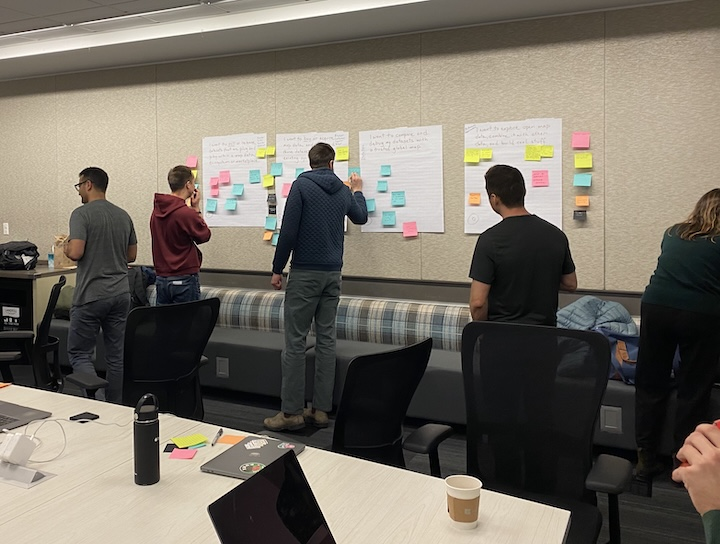

Open data projects like Overture are built across time. Contributors come and go, member companies rotate people in and out, and the builders of today are extending the work of those who came before them. Part of the work of Overture is documenting _how_ we work, to help new contributors quickly get up to speed and to capture the immense technical and organizational knowledge built up over the past few years.

*OG Overture developers from multiple organizations taking a break from coding for some analog collaboration and documentation, February 2024.*

Our contributor base itself is wide. People bring code, documentation, data analysis, quality checks, and more to the project, and they come from an incredibly diverse range of organizations: big tech, scrappy startups, nonprofits, government agencies, and open data communities. This diversity is a strength, giving us a wide range of perspectives and skills. It can also create friction, since these organizations bring different goals, tools, constraints, development velocities, and cultures.

Rather than subjecting our contributors to a strict set of engineering guidelines, we want to communicate a set of higher-level values. These values should be reflected throughout the development cycle, in the documentation we write and the pull requests we post. Beyond giving developers flexibility, this approach is AI-friendly: skills and agents can use this document as broad context for testing intent.

The "Developer Tenets" below are adapted from our internal Overture operations guide. We're publishing them because they're the kind of thing that benefits from being out in the open, where contributors and downstream users can see how we think about building Overture, at least from the engineering side. The tenets were defined by the developers, and Claude helped expand them with examples and code review guidance, i.e. "what to check." That pattern (humans setting direction, AI in a supporting role) is central to how we operate.

{/* truncate */}

## Follow the Footsteps of Those Before You

_**What it is:**_ Understand and follow how we work as developers within Overture — the architecture we use as scaffolding, how we use GitHub, how we document code, and how we structure pipelines. Before starting work, take time to understand the conventions already in place. Contributions that ignore established patterns create maintenance burden and make code harder to review and debug.

## Documentation Beyond Code

_**What it is:**_ Code alone is not documentation. Requirements, design documents, test plans, and inline comments for complex business logic are all important parts of a properly-documented change. Documentation is not something added at the end of a project — it should be built out and reviewed during the appropriate development phase. This is especially important for Overture given its collaborative nature and the likelihood of developer turnover. When the next contributor picks up your work, the documentation should tell them what you built, why you built it that way, and how to verify it is working correctly.

_**What to check:**_ Significant new features or architectural changes submitted without a linked design doc; complex business logic without inline comments explaining the "why"; new DAGs without doc_md populated; PRs that introduce new pipeline behavior without a test plan; documentation that appears to have been added only as a merge prerequisite rather than developed alongside the code.

## Invest in Stability

_**What it is:**_ Our code needs to be predictable and deterministic. Given a fixed set of inputs, the output should be the same every time. Extra effort should be invested in automation, handling edge and corner cases, full traceability of data through the pipeline, and writing code that is easy to test and verify. Instability in pipeline behavior is one of the most expensive problems at release time — it creates thrashing, difficult debugging sessions, and erodes trust in the data.

_**What to check:**_ Non-deterministic behavior where results vary across runs without any change in input data; missing handling for null values, empty datasets, or unexpected input shapes; manual steps that could be automated and therefore made repeatable; changes that introduce hard-to-trace side effects on shared state or downstream stages; insufficient test coverage for failure modes and edge cases.

## Design for Operations

_**What it is:**_ The release operations team is the customer of every pipeline component we write. Code must be designed with its operators in mind — clear, actionable error messages; logging at the appropriate level for debugging; simple and consistent pipeline behavior; and documentation of common failure modes. A pipeline that fails silently or with cryptic errors places a disproportionate burden on the operations team and puts releases at risk.

_**What to check:**_ New DAGs or task groups with no structured logging on failure; error messages that do not distinguish between configuration errors, data errors, and infrastructure errors; pipeline stages that can fail ambiguously where the error looks the same regardless of root cause; new critical-path components without notes on expected behavior or known failure modes; changes to retry counts, timeouts, or short-circuit logic without documentation explaining the intent.

## Our Product is Data; Software is How We Build It

_**What it is:**_ Overture's deliverable is high-quality, schema-compliant geospatial data. Code is a means to that end. Thorough testing of a change involves not only unit tests and scalability tests, but also evaluating the impact on the data we output. A technically correct implementation that degrades data coverage, completeness, or schema compliance is not complete. Before a change is considered done, the developer should be able to articulate the expected effect on output data.

_**What to check:**_ PRs that change pipeline logic without demonstrating impact on output data — feature counts, attribute completeness, schema compliance; schema-affecting changes without a before/after data comparison; matchers or adjudicators updated without benchmarking against known data samples; new pipeline stages merged without running against real data; missing or removed data validation checks.

## Balance Cost and Performance

_**What it is:**_ Overture has limited resources. Optimization and performance need to be balanced with cost. Developers should be aware of the compute and storage costs their code incurs and should not leave low-hanging fruit on the table. The most common offenders are over-allocated Spark clusters and inefficient algorithms or design patterns that iterate through data unnecessarily.

_**What to check:**_ Spark jobs with executor counts or memory allocations significantly larger than the data volume warrants; algorithms that perform multiple full dataset scans where a single pass would suffice; iteration over large datasets in Python where a set-based or Spark operation would be appropriate; SQL or Spark transformations that don't take advantage of partitioning or predicate pushdown; patterns that reprocess data that could be cached or reused.

---

Curious to learn more or get involved? Visit our About pages to [meet the staff](https://overturemaps.org/about/who-we-are/) and [member organizations](https://overturemaps.org/about/members/) behind Overture. Dive into [the docs](https://docs.overturemaps.org/) and contribute to our [public projects on GitHub](https://github.com/OvertureMaps), subscribe to [our community newsletter](https://share.hsforms.com/1T38OzgVmQPG7AQTdAyBizQ4tvhy?__hstc=180738424.dd8e59c2fa5c30bf706b680bba6d5255.1774625963672.1779998929067.1780002709543.40&__hssc=180738424.4.1780002709543&__hsfp=549b384a322d494ea6d03f5ea8ef0a17) for regular updates, or [become a member](https://overturemaps.org/become-a-member/) to help shape the future of open map data infrastructure.
