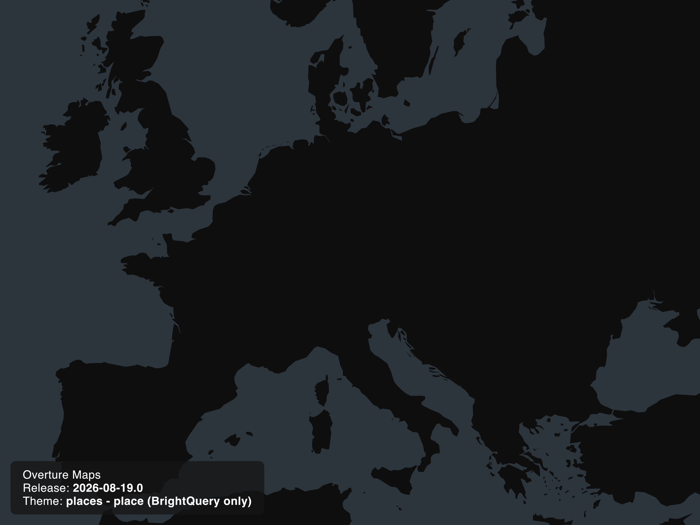

import Tabs from '@theme/Tabs';
import TabItem from '@theme/TabItem';
import QueryBuilder from '@site/src/components/queryBuilder';

:::info

Today, Overture released a patch for the September data. The new release paths are:

#### Amazon S3
```
s3://overturemaps-us-west-2/release/2026-09-23.1
```

#### Microsoft Azure
```
wasbs://release@overturemapswestus2.blob.core.windows.net/2026-09-23.1
```

Shortly after this release went public, we found a bug in the new GERS ID generation for base and building_parts features. This patch fixes the issue by fixing the UUIDs assigned to the base and building_parts for this release.

:::

## Overview

**The `2026-09-23.0` release of Overture data and `v2.0.0` of the Overture schema are now available.** This is a major schema release: the deprecated `categories` property has been removed from the places theme in favor of `taxonomy`. Places grew 10.6% to 81.5 million features, as BrightQuery coverage expanded into Germany, Italy, Denmark, and Canada.

You can access the datasets, changelog, GERS registry, bridge files, and PMTiles on AWS and Azure at the paths listed below.


## Breaking Changes

- **`categories`** (`places`): removed the `categories` property entirely, including `categories.primary` and `categories.alternate`. Use `taxonomy` (`taxonomy.primary`, `taxonomy.hierarchy`, `taxonomy.alternates`) or `basic_category` instead.
- **`sources`** (`addresses`): added `provider`, `resource`, and `version` fields to the `sources` struct, and renamed source dataset labels to a `provider/resource` form.


## Getting the data and release artifacts

You can access this month's data and release artifacts by following the process outlined in our [docs](/getting-data). We encourage you to ask questions and provide feedback on the Overture Maps [Discussion forum on GitHub](https://github.com/orgs/OvertureMaps/discussions). You can also file issues and report bugs in our [data](https://github.com/OvertureMaps/data/issues) and [schema](https://github.com/OvertureMaps/schema/issues) repositories. If you have a suggestion for a new dataset or if you have data you'd like to contribute to Overture, you can email us at community@overturemaps.org. We'd love to hear from you.


### Release data

**Microsoft Azure:**
```
https://overturemapswestus2.blob.core.windows.net/release/2026-09-23.0/
```

**Amazon S3:**
```
s3://overturemaps-us-west-2/release/2026-09-23.0/
```

### Data changelog

**Microsoft Azure:**
```
https://overturemapswestus2.blob.core.windows.net/changelog/2026-09-23.0/
```

**Amazon S3:**
```
s3://overturemaps-us-west-2/changelog/2026-09-23.0/
```

### Bridge files

**Microsoft Azure:**
```
https://overturemapswestus2.blob.core.windows.net/bridgefiles/2026-09-23.0/
```

**Amazon S3:**
```
s3://overturemaps-us-west-2/bridgefiles/2026-09-23.0/
```

### GERS registry

**Microsoft Azure:**
```
https://overturemapswestus2.blob.core.windows.net/registry/
```

**Amazon S3:**
```
s3://overturemaps-us-west-2/registry/
```

### PMTiles

**Amazon S3:**
```
s3://overturemaps-extras-us-west-2/tiles/2026-09-23.0/
```

{/* truncate */}


## Theme-specific updates

:::info
The base, buildings, divisions, places, and transportation themes are in GA. The addresses theme is in alpha.
:::

### Addresses

- Address count grew from 472,797,160 to 474,186,531, an increase of 0.29%.
- Ingested new regional datasets for New Caledonia (`NC`, 41,536 addresses) and French Polynesia (`PF`, 2,000 addresses), added new data sources for three counties in Taiwan and the City of New Orleans.
- Refreshed data in Italy; gained roughly 1M new addresses and improved location precision.
- Enriched the `sources` struct with `provider`, `resource`, and `version` fields, and renamed source dataset labels to a `provider/resource` form. The number of distinct source labels rose from 190 to 431 as a result. This is a labeling and provenance change; it does not by itself add or remove addresses.
- Source provenance coverage improved substantially: `sources[0].record_id` rose from 0.12% to 100%, `sources[0].update_time` from 0% to 100%, and `sources[0].license` from 0% to 100%.
- Core field coverage is stable or slightly improved: `street` 98.34% to 98.52%, `number` 92.62% to 92.78%, and `address_levels_2` 74.71% to 76.11%.

### Base

- OSM Cut-Off Date: `2026-09-12`

- Feature counts by type:

| Type | Count | Change |
|---|---|---|
| infrastructure | 157,617,917 | +1.35% |
| land_cover | 123,302,114 | 0.00% |
| land | 75,848,834 | +0.31% |
| water | 66,204,219 | +0.71% |
| land_use | 56,097,254 | +0.86% |
| bathymetry | 407,277 | +579.21% |

- Bathymetry grew from 59,963 to 407,277 features, sourced from ETOPO and GLOBathy. The growth reflects the deeper-than coverage model, in which a feature at `depth = d` covers all water deeper than `d` meters and levels nest.
- 100% GERS churn across the `infrastructure`, `land`, `land_use`, `water`, and `bathymetry` types, caused by a change in how UUIDs are generated for the theme.

### Buildings

- OSM Cut-Off Date: `2026-09-12`

- Building count grew from 2,529,582,613 to 2,533,842,612, an increase of 0.17%. Building parts grew from 4,339,150 to 4,486,107, an increase of 3.39%.

| Source | Building Count | Change |
|---|---|---|
| Google Open Buildings | 898,130,959 | +2.91% |
| OpenStreetMap | 706,818,187 | +0.63% |
| Microsoft ML Buildings | 689,237,083 | -3.41% |
| Zenodo (doi:10.5281/zenodo.8174931) | 212,222,368 | -0.05% |
| Esri Community Maps | 15,119,688 | -6.65% |
| Instituto Geográfico Nacional (España) | 12,298,053 | -0.59% |
| City of Vancouver | 16,274 | -1.30% |

- Introduced a `shelter` class, which now carries roughly 321,000 features across the `civic`, `outbuilding`, `transportation`, `residential`, and other subtypes. Unclassed `civic` buildings fell 44.3%, from 572,100 to 318,412, as those features were reclassified.

### Divisions

- OSM Cut-Off Date: `2026-09-16`

- Feature counts by type:

| Type | Count | Change |
|---|---|---|
| division | 4,688,229 | +0.63% |
| division_area | 1,080,667 | +0.60% |
| division_boundary | 87,530 | 0.00% |

- GERS churn is low across all three types, at 1.13% for `division`, 1.29% for `division_area`, and 0.38% for `division_boundary`.
- Made mostly minor, incremental changes to the theme this month.

### Places

Places grew 10.6% this release, driven by the expansion of BrightQuery coverage beyond the United States.

- Removed the deprecated `categories` property in favor of `taxonomy` and `basic_category`.
- Place count grew from 73,631,092 to 81,455,425, an increase of 10.63%.
- Expanded BrightQuery from United States-only coverage to coverage in the United States, Germany, Italy, and Denmark. Added additional US places under the `services_and_business` category. BrightQuery places grew from 2,289,171 to 10,255,071, an increase of 348%.
- Operating status coverage improved: places marked `open` grew 66.2%, from 11,047,288 to 18,361,914.



BrightQuery place density, August vs. September: new coverage appears across Germany, Denmark, and Italy.

| Top Level Taxonomy | Count |
|---|---|
| Services and Business | 21,176,033 |
| Shopping | 14,395,494 |
| Food and Drink | 10,559,834 |
| Health Care | 5,202,712 |
| Lifestyle Services | 5,007,526 |
| Travel and Transportation | 4,198,209 |
| Education | 3,597,112 |
| Cultural and Historic | 3,167,325 |
| Sports and Recreation | 3,003,530 |
| Community and Government | 2,826,472 |
| Lodging | 2,760,980 |
| Arts and Entertainment | 1,637,265 |
| Geographic Entities | 985,270 |
| Uncategorized | 2,937,653 |

### Transportation

- OSM Cut-Off Date: `2026-09-09`

| Dataset | Feature Count | Length (km) |
|---|---|---|
| OpenStreetMap | 763,031,646 | 94,863,688 |
| TomTom | 11,002,041 | 1,989,269 |

| Subtype | Length (km) |
|---|---|
| road | 93,369,000 |
| rail | 2,884,199 |
| water | 599,758 |

#### Change Summary

##### Count Changes

| Dataset | Type | Diff | Diff (%) |
|---|---|---|---|
| TomTom | segment | 573,800 | 5.50% |
| OpenStreetMap | connector | 2,438,484 | 0.58% |
| OpenStreetMap | segment | 1,011,532 | 0.30% |

##### Length Changes

| Subtype | Diff (km) | Diff (%) |
|---|---|---|
| road | 263,339 | 0.28% |
| water | 5,637 | 0.95% |
| rail | 3,695 | 0.13% |

- GERS churn is low, at 0.85% for connectors and 0.94% for segments.

## Schema changelog

The changelog for Overture schema `v2.0.0` is [here](https://github.com/OvertureMaps/schema/releases/tag/v2.0.0).

## Attribution

You'll find information about attribution and licensing [here](/attribution).
