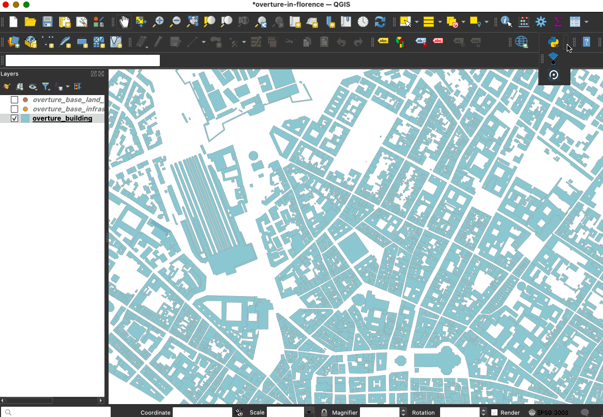

# Load Overture data into QGIS

In this example, we'll show you how to get Overture data into [QGIS](https://www.qgis.org/), a powerful open GIS and mapping platform. 

## Method 1: Using the GeoParquet Downloader plugin (recommended)

You can load Overture data directly into QGIS using the [GeoParquet Downloader plugin](https://github.com/cholmes/qgis_plugin_gpq_downloader). This plugin treats cloud-hosted GeoParquet files like a data service, pulling only the features within your current map view. It uses DuckDB under the hood to query the data in Overture's cloud storage and automatically converts that data to your preffered format.

### Installation

The plugin is available through QGIS's standard plugin repository. To install it:

- Open QGIS Plugin Manager (`Plugins → Manage and Install Plugins`)
- Search for "GeoParquet Downloader"
- Install and restart QGIS if prompted

After installation, you'll find a new toolbar for accessing Overture data and other cloud-native geospatial datasets, from [Source Cooperative](https://source.coop/) and [OpenStreetMap](https://openstreetmap.us/our-work/layercake/). Most installations handle DuckDB automatically, though some systems may require additional setup, see these [installation instructions](https://github.com/cholmes/qgis_plugin_gpq_downloader/blob/main/README.md#installation) for more information. Note: To save the data as GeoParquet files, your QGIS installation needs GDAL version 3.8 or higher. For macOS, we recommend [using Pixi](https://github.com/cholmes/qgis_plugin_gpq_downloader/wiki/Installing-GeoParquet-Support-in-QGIS#osx) to install QGIS and the necessary dependencies in a separate environment. 

### Example

Let's add streets to our map of buildings in Florence, Italy:

1. **Zoom to your area**: Pan and zoom in QGIS to Florence
2. **Launch the downloader**: Click the plugin's toolbar icon
3. **Configure your download**:
   - Source: Overture Maps
   - Theme: Addresses, Base, Buildings, Divisions, Places or Transportation
   - Output: GeoParquet, GeoPackage, DuckDB, GeoJSON or FlatGeobuf
4. **Load the data**: The plugin queries Overture's cloud storage and downloads data in the bounding box defined by your current view in QGIS.

The entire process typically takes seconds to minutes depending on data density. You can change your view and reload to pull data in different areas. You can also load additional datasets in your map.

   

## Method 2: Importing Overture data 

If you already have Overture data files stored locally, you can import them or drag and drop them into QGIS. GeoParquet files work as first-class vector data sources in QGIS, just like Shapefiles or GeoPackage. You have several options for loading them:

- **Drag and drop**: The fastest method—simply drag GeoParquet files from your file manager directly onto the QGIS map canvas
- **Batch import**: Select multiple Parquet files and drop them simultaneously to build multi-layer projects instantly
- **Data Source Manager**: Use `Layer → Add Layer → Add Vector Layer`, then browse to your Parquet files
- **Browser panel**: Navigate to your files in the QGIS Browser panel and double-click to add them

## Resources and next steps

- Explore the [GeoParquet Downloader plugin repository](https://github.com/cholmes/qgis_plugin_gpq_downloader) for updates and additional examples.
- Learn about [Overture's schema](https://docs.overturemaps.org/schema/) to better understand the properties available.
- Chat with the [Overture community](https://github.com/OvertureMaps/data/discussions) to share workflows and get help.
