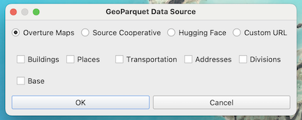

import Tabs from '@theme/Tabs';
import TabItem from '@theme/TabItem';
import QueryBuilder from '@site/src/components/queryBuilder';
import BoulderCoDuckDB from '!!raw-loader!@site/src/queries/duckdb/boulder_co_duckdb.sql';

In this example, we'll show you how to get Overture Maps data into [QGIS](https://www.qgis.org/), a powerful open GIS and mapping platform. QGIS offers multiple pathways to work with Overture's cloud-native GeoParquet files, from streaming data for specific areas to working with complete datasets locally.

## Method 1: Stream data with the GeoParquet Downloader plugin (recommended)

Instead of downloading large datasets, you can stream Overture data directly into QGIS. The [GeoParquet Downloader plugin](https://github.com/cholmes/qgis_plugin_gpq_downloader) treats cloud-hosted GeoParquet files like a data service, pulling only the features within your current map view. It uses DuckDB under the hood to query the data in Overture's cloud storage and automatically converts that data to your preffered format.

### Installation

The plugin is available through QGIS's standard plugin repository. To install it:

- Open QGIS Plugin Manager (`Plugins → Manage and Install Plugins`)
- Search for "GeoParquet Downloader"
- Install and restart QGIS if prompted

After installation, you'll find a new toolbar for accessing Overture data and other cloud-native geospatial datasets, from [Source Cooperative](https://source.coop/) and [Hugging Face](https://huggingface.co/datasets). Most installations handle the DuckDB automatically, though some systems may require additional setup. Note: To work with GeoParquet files, your QGIS installation needs GDAL version 3.5 or higher.

### Example

Let's grab building footprints in downtown Boston:

1. **Zoom to your study area**: Pan and zoom in QGIS to downtown Boston
2. **Launch the downloader**: Click the plugin's toolbar icon
3. **Configure your download**:
   - Source: Overture Maps
   - Theme: Buildings
   - Output: GeoParquet, GeoPackage, DuckDB, GeoJSON or FlatGeobuf

   

4. **Stream the data**: The plugin queries Overture's cloud storage and downloads only buildings visible in your current view

The entire process typically takes seconds to minutes depending on data density. You can change your view and reload to explore data in different areas. You can also load additional datasets in your map.

## Method 2: Import Overture data directly

If you already have Overture data files stored locally, you can import them or drag and drop them into QGIS. GeoParquet files as first-class vector data sources in QGIS, just like Shapefiles or GeoPackage. You have several options for loading them:

- **Drag and drop**: The fastest method—simply drag GeoParquet files from your file manager directly onto the QGIS map canvas
- **Batch import**: Select multiple Parquet files and drop them simultaneously to build multi-layer projects instantly
- **Data Source Manager**: Use `Layer → Add Layer → Add Vector Layer`, then browse to your Parquet files
- **Browser panel**: Navigate to your files in the QGIS Browser panel and double-click to add them

## Troubleshooting

| Challenge | Try this |
|---|---|
| Large areas taking too long to load | _Smaller viewports download faster. Start zoomed in, then expand your area as needed_ |
| Memory issues with dense data | _Use GeoParquet format which QGIS can read more efficiently than GeoJSON_ | 
| Need offline access to large regions | _Download datasets locally and import them into QGIS before going offline_ | 
| Properties are nested or complex | _Some of Overture's properties have a complex structure; try using QGIS expressions to extract sub-properties_ | 

## Resources and next steps

- Explore the [GeoParquet Downloader plugin repository](https://github.com/cholmes/qgis_plugin_gpq_downloader) for updates and additional examples.
- Learn about [Overture's schema](https://docs.overturemaps.org/schema/) to better understand the properties available.
- Chat with the [Overture community](https://github.com/OvertureMaps/data/discussions) to share workflows and get help.
