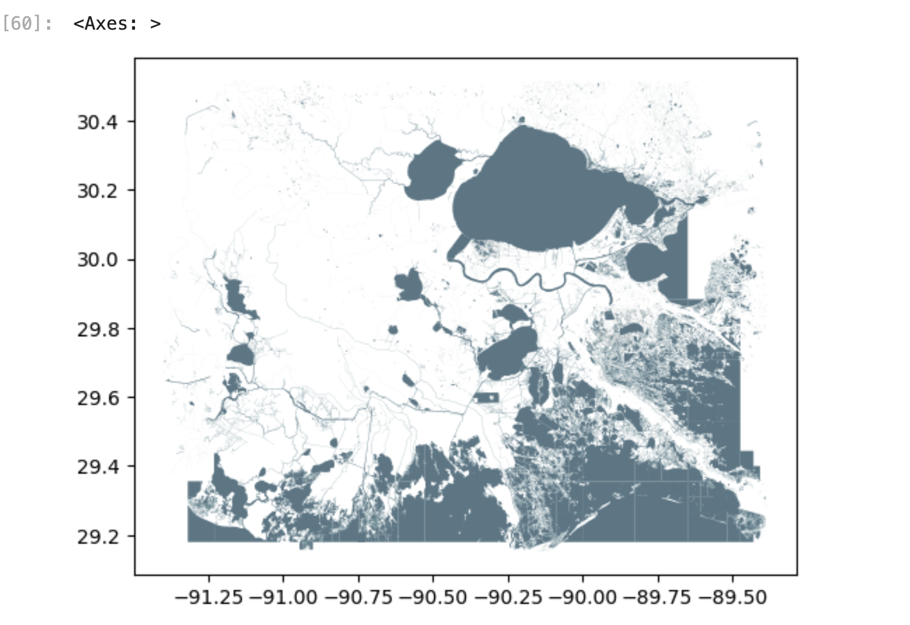

import Tabs from '@theme/Tabs';
import TabItem from '@theme/TabItem';


In this example, we'll show you how to use [DuckDB](https://duckdb.org/) and [Pandas](http://pandas.pydata.org/) to extract and manipulate Overture data in a Jupyter notebook. We're using a Pandas DataFrame as an ideal structure for handling a small to medium amount of data and [GeoPandas](https://geopandas.org/en/stable/index.html) to extend Pandas for operations on geometric types. DuckDB allows us to fetch only the data we need from Overture's GeoParquet files stored on Microsoft Azure or AWS S3.

<details>

    <summary>
    **Installation requirements**

    </summary>
To follow along with these examples, you should have [JupyterLab or Jupyter Notebook](https://jupyter.org/) running and the following dependencies installed:

- [Pandas](https://pandas.pydata.org/)
- [GeoPandas](https://geopandas.org/en/stable/index.html)
- [DuckDB](https://duckdb.org/), [DuckDB spatial extension](https://duckdb.org/docs/extensions/spatial.html), and [DuckDB AWS extension](https://duckdb.org/docs/extensions/aws.html) or [DuckDB azure extension](https://duckdb.org/docs/extensions/azure.html).
- [JupySQL](https://jupysql.ploomber.io/en/latest/quick-start.html) (optional)
- [duckdb-engine](https://github.com/Mause/duckdb_engine) (optional)

</details>
A executable version of this notebook is available on [Notebook Sharing Space](https://notebooksharing.space/view/1d0d72d24ed82d22a8101377ca811ab7365b6a67dac98f3add034719c44b537f#displayOptions=). More examples are available in [the notebooks directory](https://docs.overturemaps.org/) in our docs repository on GitHub.

## Example

Let's start by importing our toolkit.

```python
# import our toolkit
import pandas as pd
import geopandas as gpd
import duckdb
from shapely import wkt
```

```python
# no need to import duckdb_engine, JupySQL will auto-detect driver
# load (or reload) jupysql Jupyter extension to create SQL cells
%reload_ext sql
```

The DuckDB documentation offers tips and examples for [running DuckDB queries in Jupyter notebooks](https://duckdb.org/docs/guides/python/jupyter.html). In this example, we're using duckdb-engine and JupySQL. You can also connect to DuckDB natively.

```python
# DuckDB in-memory database
%sql duckdb://
```

Next, we'll install and load DuckDB extensions to work with spatial data and connect to AWS. (Or you can use the Azure extension to connect to the Overture data stores on Azure.)

```python
%sql INSTALL spatial;
%sql INSTALL httpfs;
%sql LOAD spatial;
%sql LOAD httpfs;
%sql SET s3_region='us-west-2'
```
 We can set the configurations on JupySQL to directly output data to Pandas and to simplify the output that is printed to the notebook.

```python
%config SqlMagic.autopandas = True
%config SqlMagic.feedback = False
%config SqlMagic.displaycon = False
```

Now we're going to extract data from Overture's base theme for an area along the Gulf Coast. The magic %%sql command turns the notebook cell into a SQL cell and allows us to dump our query results in a Pandas DataFrame. Note: this query takes about a minute run.

```python
%%sql gulf_water <<
SELECT
    id,
    names.primary AS primary_name,
    ST_AsText(geometry) as geometry
FROM
    read_parquet('s3://overturemaps-us-west-2/release/2024-09-18.0/theme=base/type=water/*', filename=true, hive_partitioning=1)
WHERE
    bbox.xmin >= -91.3994
        and bbox.xmax <= -89.3864
        and bbox.ymin >= 29.152
        and bbox.ymax <= 30.5161
```

DuckDB 1.1.0 is able to interpret the geometry stored as a binary object in the GeoParquet file as a Shapely `geometry` type.

```python
# dataframe to geodataframe, set crs
gulf_water_gdf = gpd.GeoDataFrame(
    gulf_water,
    geometry=gulf_water['geometry'].apply(wkt.loads),
    crs="EPSG:4326"
)
```
Let's work with just the water polygons and lines, not the points.

```python
# Apply a lambda to remove point geometries
gulf_water_gdf = gulf_water_gdf[gulf_water_gdf['geometry'].apply(lambda x : x.geom_type!='Point' )]
```

Let's make a quick plot of the data. Voilà!

```python
gulf_water_gdf.plot(facecolor="#628290", edgecolor="#006064", lw=0.05)
```



## Next steps

- Want to speed things up and work with larger extracts of Overture data? Check out our [Lonboard tutorial](../lonboard).
