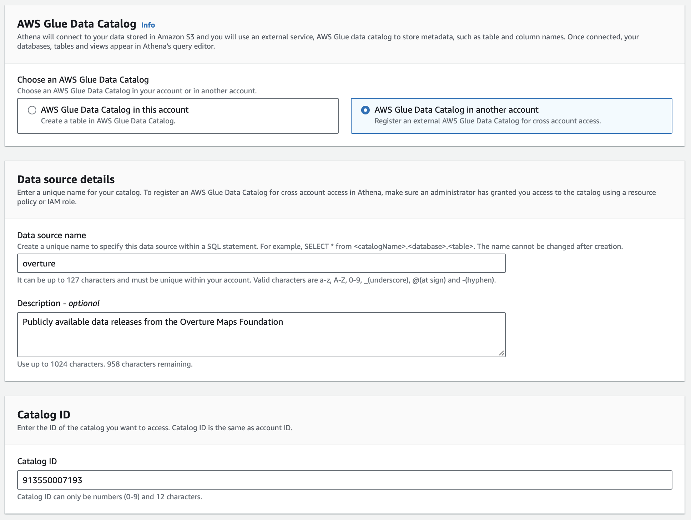
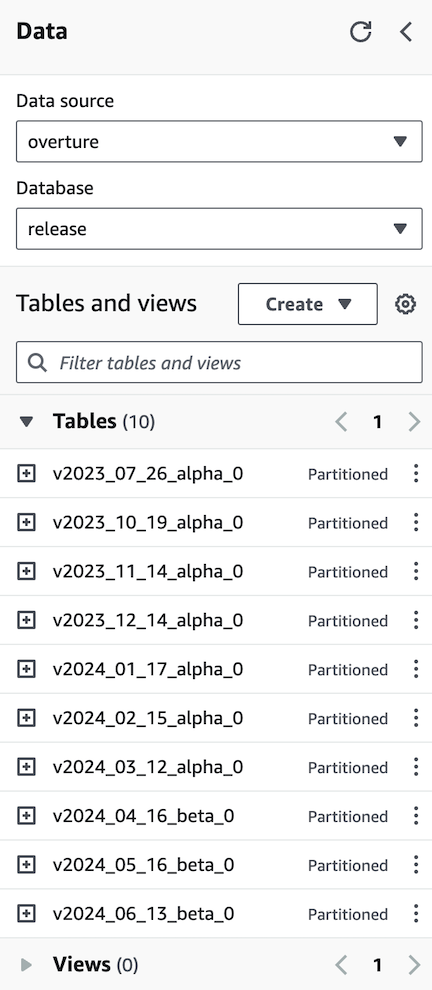

import QueryBuilder from '@site/src/components/queryBuilder';
import AthenaSelectExample from '!!raw-loader!@site/src/queries/athena/0_select_from_release.sql';
import SeattlePlaces from '!!raw-loader!@site/src/queries/athena/seattle_places.sql';

You can follow the steps belows to access and query Overture data directly in AWS. Note: you will need to create an account to use [Athena](https://aws.amazon.com/athena/) and other AWS services.

:::info
   Overture's S3 bucket is located in the us-west-2 AWS region, so you will need to set your region to `us-west-2`.
:::


## 1. Add Overture as a data source

Add Overture as a cross-account data source using [these instructions](https://docs.aws.amazon.com/athena/latest/ug/data-sources-glue-cross-account.html). The Catalog ID is `913550007193`.

  <details>
        <summary>AWS Glue Data Catalog</summary>
        <div>
            
        </div>
    </details>


Depending on the permissions attached to your AWS user account/role, you may need to explicitly enable access to the Overture catalog. You can do that by [adding a new IAM policy](https://console.aws.amazon.com/iam/home?#/policies?type=customer) &mdash; we suggest calling it `OvertureGlueCatalogAccess` &mdash; with the following permissions:

<details>
  <summary>IAM policy for Overture Glue Data Catalog access</summary>
  <div>
```json
{
  "Version": "2012-10-17",
  "Statement": [
    {
      "Effect": "Allow",
      "Action": [
        "glue:GetTable*",
        "glue:GetDatabase*",
        "glue:GetPartition*"
      ],
      "Resource": [
        "arn:aws:glue:us-west-2:913550007193:catalog",
        "arn:aws:glue:us-west-2:913550007193:database/release",
        "arn:aws:glue:us-west-2:913550007193:table/*"
      ]
    }
  ]
}
```
  </div>
</details>


## 2. Inspect release tables

Each release is available as a table under the `release` database in the `overture` data source (note the `v` at the beginning of the table name). The `overture` data catalog will be updated with a new table for each new release.

 <details>
        <summary>Overture Maps release tables</summary>
        <div>
            
        </div>
    </details>


## 3. Access data from a release table

You can access Overture data in a particular release like this:

    <QueryBuilder query={AthenaSelectExample}></QueryBuilder>

 Here's an example query to get ~25k places in Seattle:

    <QueryBuilder query={SeattlePlaces}></QueryBuilder>

More information on using Athena is available in the [Amazon Athena User Guide](https://docs.aws.amazon.com/athena/latest/ug/what-is.html).

<!--- ## Optional

### Add the table directly using the DDL

If you prefer to create the table in your own data catalog, you can run the complete DDL query in the Athena Query Console. This will create tables in your AWS account's data catalog pointing directly to data hosted on Overture's S3 bucket.

<details>
    <summary>DDL query statement</summary>
    <div>
        <QueryBuilder query={CreateAthenaTable}></QueryBuilder>
    </div>
</details>

After you run the set-up query, you can load the partitions by running `MSCK REPAIR TABLE overture` or choosing "Load Partitions" from the table options menu.


### Add a policy in your data catalog settings

If you want to share this catalog with other users and accounts, you'll need to add a policy enabling cross-account Glue catalog access. To do so, navigate to the [data catalog settings](https://console.aws.amazon.com/glue/home#/v2/security/settings) and add a catalog policy that looks this:

<details>
  <summary>Policy for sharing Overture Maps catalog</summary>
  <div>

```json
{
  "Version": "2012-10-17",
  "Statement": [
    {
      "Effect": "Allow",
      "Principal": "*",
      "Action": [
        "glue:GetTable*",
        "glue:GetDatabase*",
        "glue:GetPartition*"
      ],
      "Resource": [
        "arn:aws:glue:<region>:<account id>:catalog",
        "arn:aws:glue:<region>:<account id>:database/release",
        "arn:aws:glue:<region>:<account id>:table/*"
      ]
    }
  ]
}
```
`release` is the name of the database containing Overture tables.
</div>
</details>
-->
