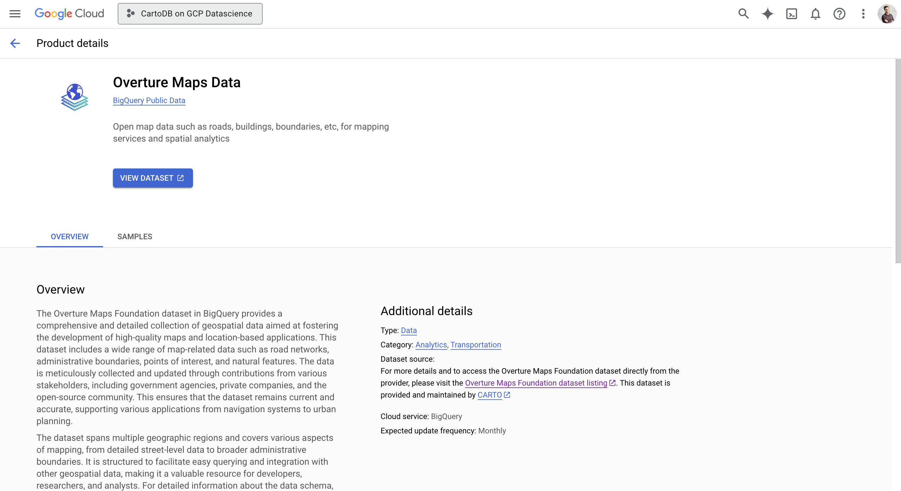
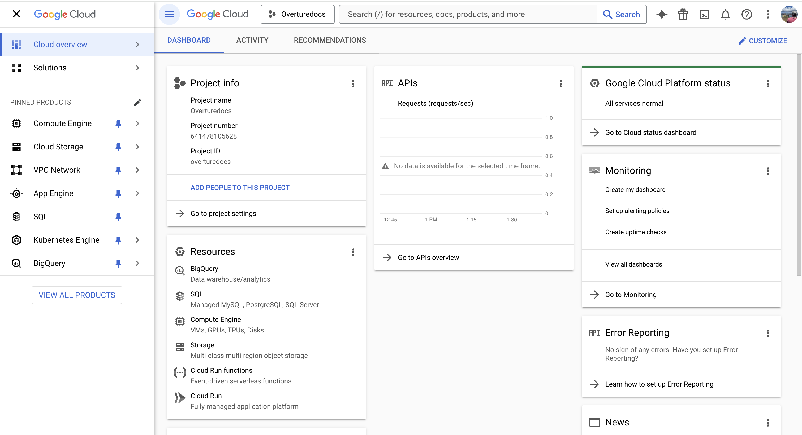
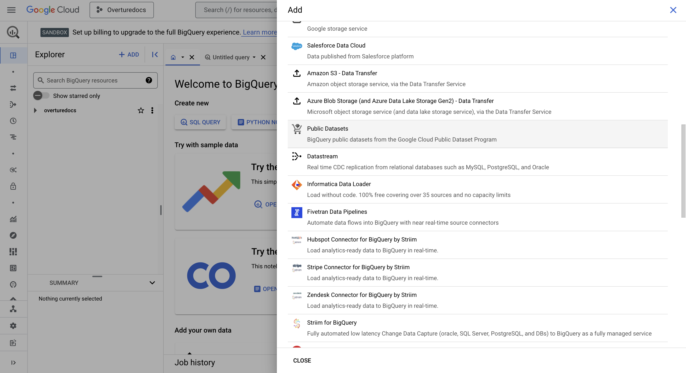
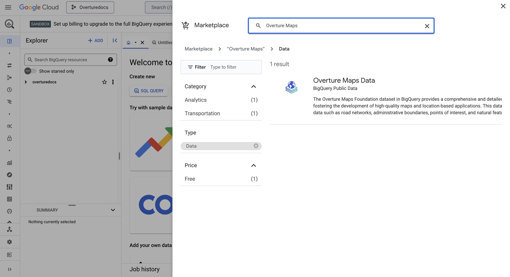
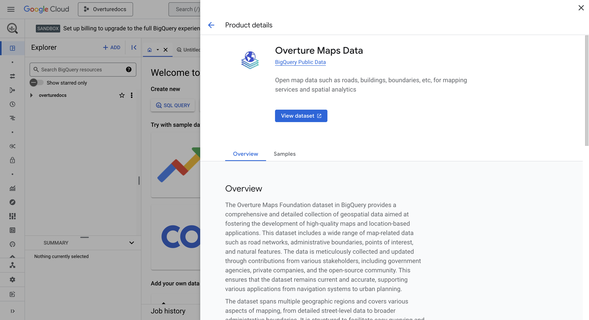
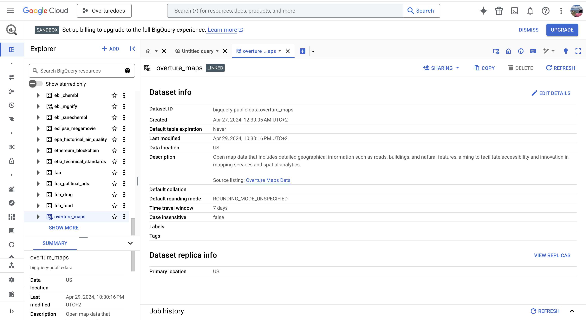
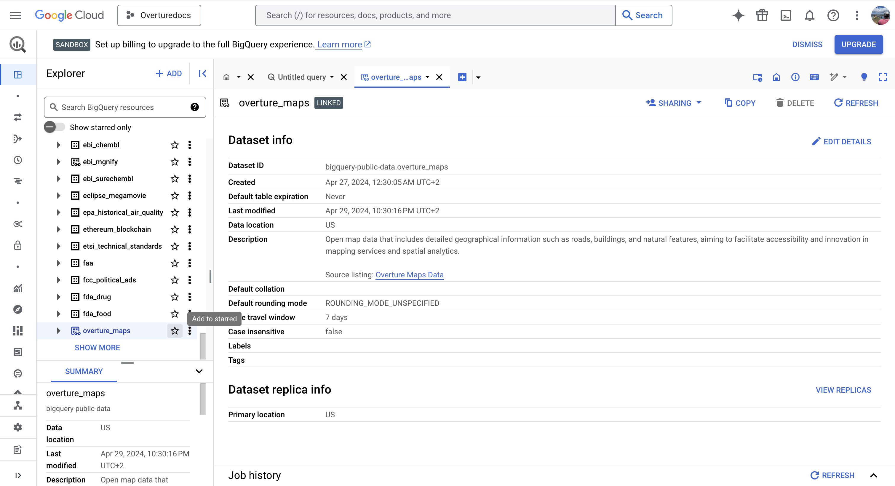
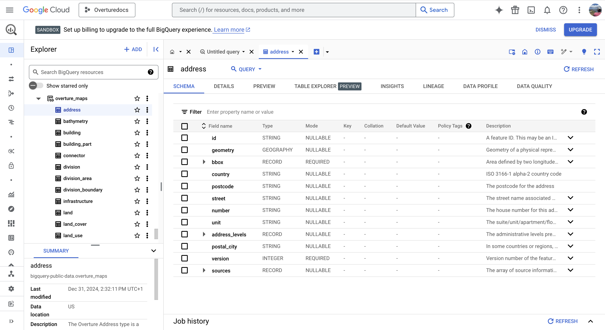
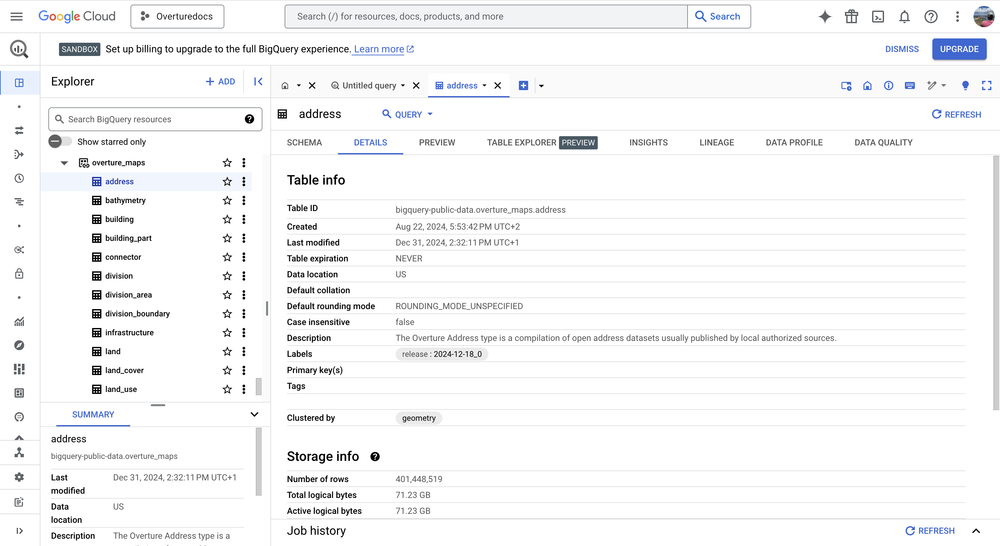
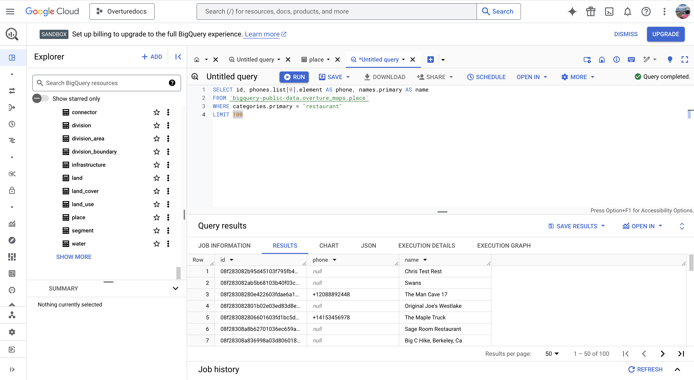

Overture data is accessible in Google BigQuery as part of the [Google Cloud Public Dataset Program](https://cloud.google.com/bigquery/public-data), with the data being listed and maintained by [CARTO](https.//www.carto.com). 





Below is a step-by-step guide on how to access and use Overture data in BigQuery: 

## Before you begin

To get started using Overture data in BigQuery, you must create or select a Google Cloud project with billing [enabled](https://cloud.google.com/billing/docs/how-to/verify-billing-enabled#confirm_billing_is_enabled_on_a_project). BigQuery is automatically enabled in new projects, but in order to activate it in a preexisting project, you should enable the [BigQuery API](https://console.cloud.google.com/apis/enableflow?apiid=bigquery&inv=1&invt=Abns8w).

## Getting Overture Data in Google BigQuery
1. Log in to your [Google Cloud Console](https://console.cloud.google.com/).
2. Navigate to the **BigQuery** section by selecting `BigQuery` from the side menu or searching for it in the search bar.





3. In the BigQuery console, click **Add Data**. Then, click on **Public Datasets**.





4. The Google Cloud data marketplace will open. In the search box look for **Overture Maps**. 





5. Select the **Overture Maps Data** listing. Then, click on **View dataset**. 





6. Back again in the BigQuery console you will see the `bigquery-public-data` project and the `overture_maps`dataset selected.  





7. Our recommendation is that you add the `overture_maps` dataset or entirely the `bigquery-public-data` project in your starred selection in order to have access to the Overture data always at hand.





## Working with Overture Data in BigQuery

8. Now that Overture Maps data is available in your BigQuery console, you can start using it. Note that in the `overture_maps` dataset you have access to all tables from all the different Overture Maps themes: Addresses, Base, Buildings, Divisions, Places and Transporatation. 





9. The release version is detailed as a `label` in each of the tables. You can check it out in the **Details** section of each table.





10. You can now query any of the tables directly from your SQL Editor in BigQuery. Here's one example for the Places data in Overture Maps.





```sql
// Identify places within the "Restaurant" category
SELECT id, phones.list[0].element AS phone, names.primary AS name 
FROM `bigquery-public-data.overture_maps.place` 
WHERE categories.primary = "restaurant"
LIMIT 100;
```

## Additional Notes

- **Updates**: CARTO regularly updates the Overture datasets in BigQuery and keeps the dataset synced with the last release. You can check the release version of the data as a metadata label in each table. 
- **Support**: If you encounter issues accessing the data, contact CARTO support via support@carto.com.
- **CARTO**: Once you have the Overture data you need in BigQuery, you can use CARTO's cloud-native spatial analytics platform running on your BigQuery account to build interactive maps, data procesing and analytical workflows or geospatial applications. Not yet on CARTO? Open a 14-day free trial [here](https://www.carto.com/signup).
