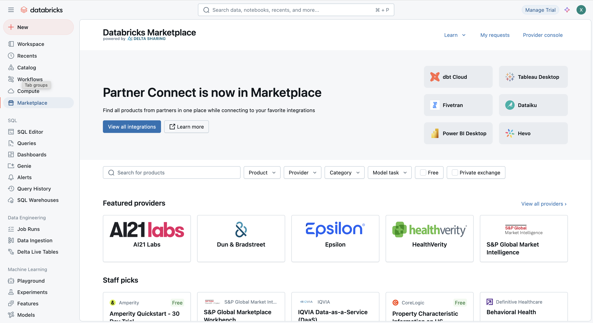
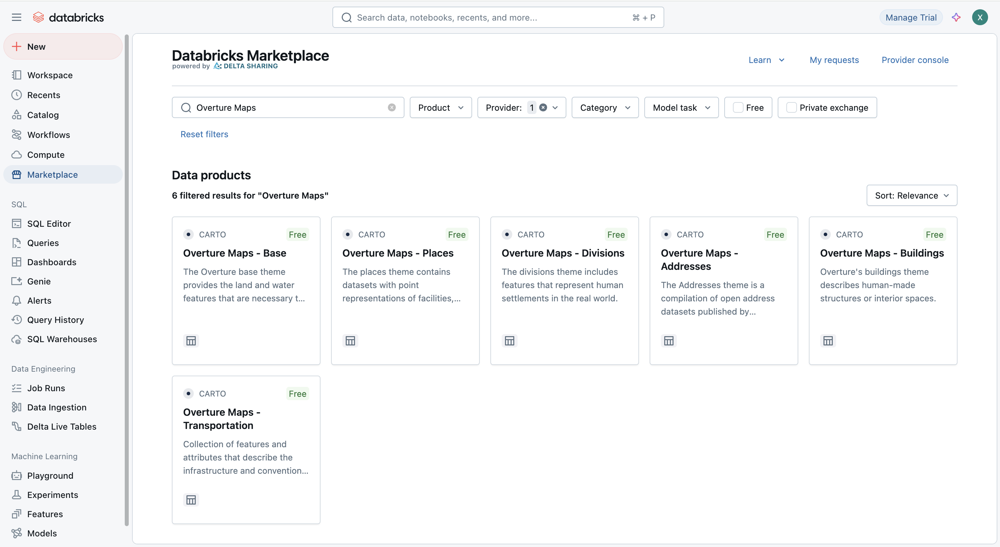
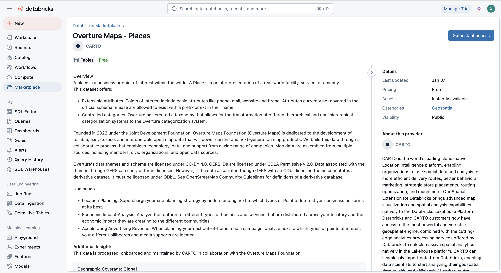
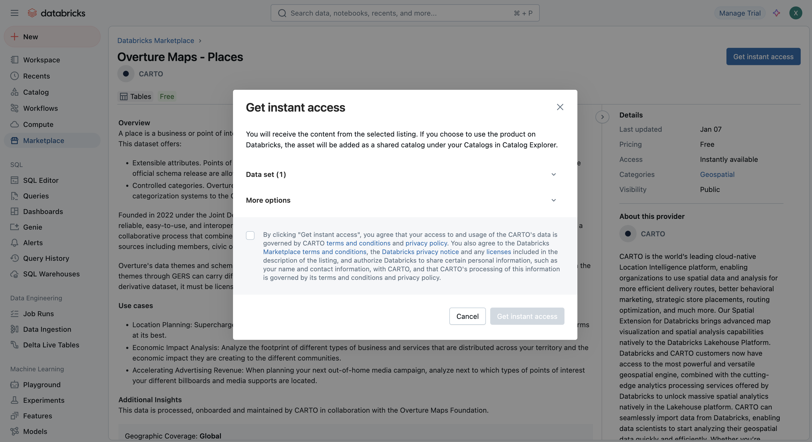
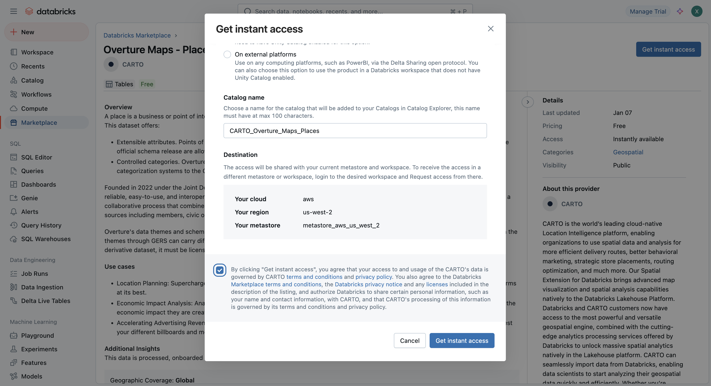
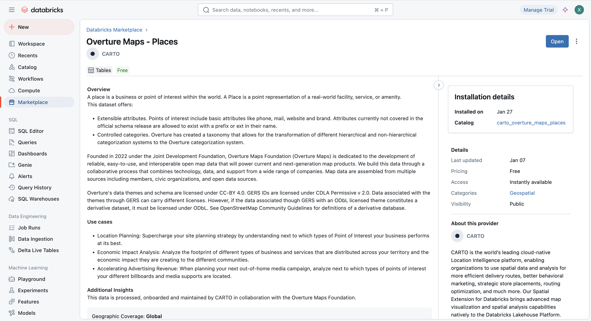
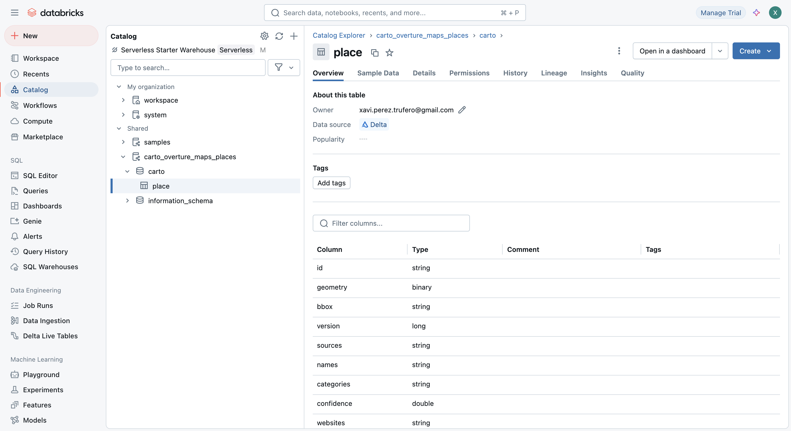
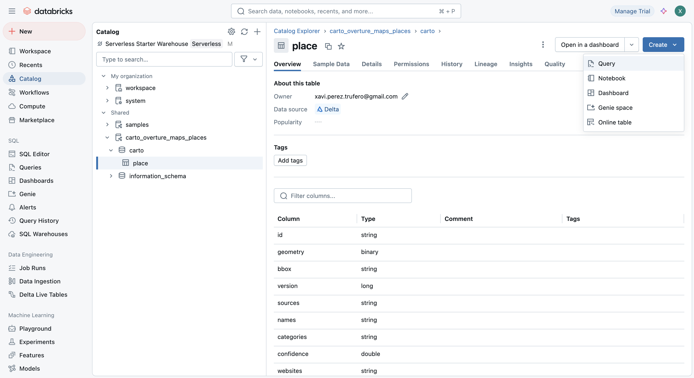
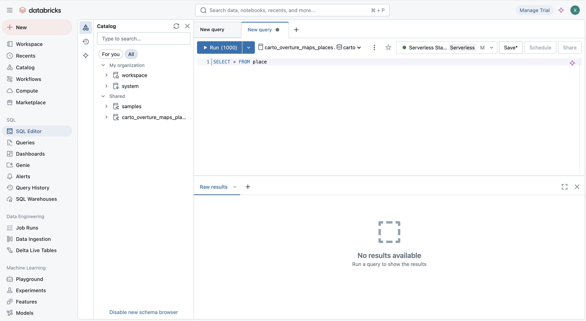

Overture data is accessible through the [Databricks Marketplace](https://marketplace.databricks.com/?searchKey=CARTO&sortBy=date) via public listings published and maintained by [CARTO](https://www.carto.com). Below is a step-by-step guide on how to access and use the data:

## Before you begin

Before accessing the Overture Maps data in Databricks, ensure you have:

- **Databricks Account**: An active Databricks account with access to the Databricks Marketplace.
- **Workspace Access**: A Databricks workspace where you can import and analyze the data.
- **Marketplace Permissions**: The appropriate permissions to browse and subscribe to datasets in the Databricks Marketplace.

## Getting Overture data from Databricks Marketplace

1. Log in to your Databricks workspace.
2. From the Databricks workspace home page, navigate to the **Databricks Marketplace** by selecting the **Marketplace** tab from the sidebar.

    

3. Use the search bar in the Databricks Marketplace to search for `CARTO` or `Overture Maps`.

    

4. The listings have been organized by Overture theme; therefore, you will find the following listings available: Addresses, Base, Buildings, Divisions, Places and Transportation. Select one to access the listing details.

    

5. Review the dataset description, terms of use, and any documentation provided by CARTO.
6. Click **Get instant access** to request access to the dataset.

    

7. Before you get access you can specify where are you planning to use the data and also provide a custom name to the Databricks Catalog in which the data will be made available. After accepting the terms, click on **Get instant access**.

    

8. Now, in the same listing page you have the option to click on **Open**.

    

9. After clicking on **Open** you will be taken to your Catalogs with the newly created Catalog `carto_overtue_maps_places`open.

    

## Working with Overture data in Databricks

1. Once you have the Overture Maps data that you need in your Catalogs you can start working with it. Following our example, in the Place table you can click on **Create** and then **Query**.

    

2. That will open the SQL Editor ready to query the `place` table.

    

## Additional notes

- **Updates**: CARTO regularly updates the Overture datasets in Databricks and keeps the listings synced with the last release. You can check the release version of the data from the share description in each listing.
- **Support**: If you encounter issues accessing the data, contact CARTO support via [support@carto.com](mailto:support@carto.com).
- **Databricks**: For more information on Databricks Marketplace, refer to the official [Databricks documentation](https://docs.databricks.com/en/marketplace/index.html).
