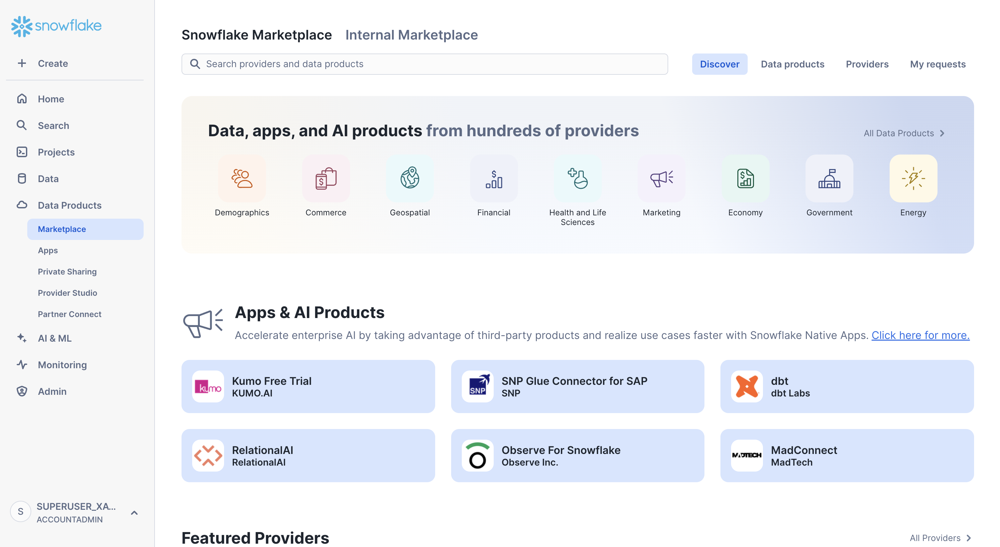
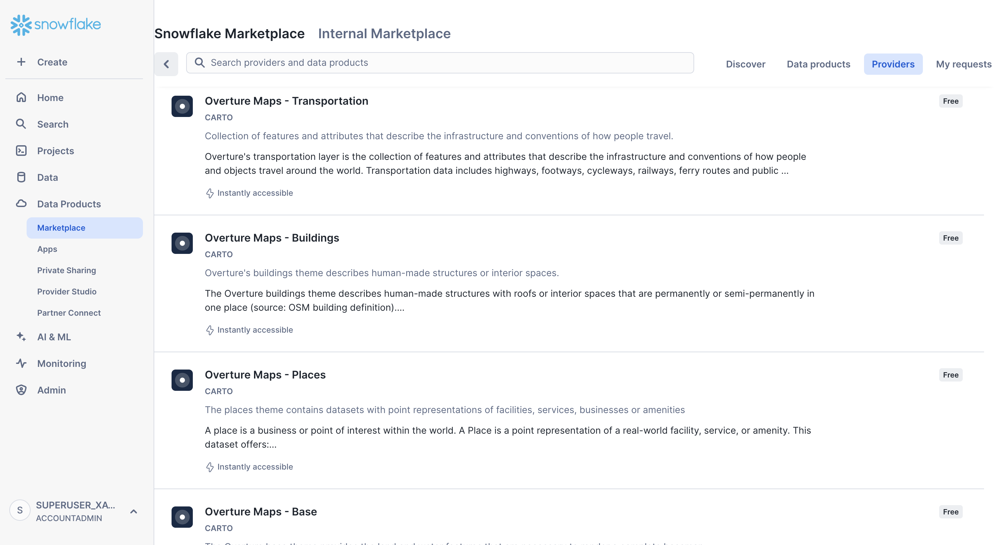
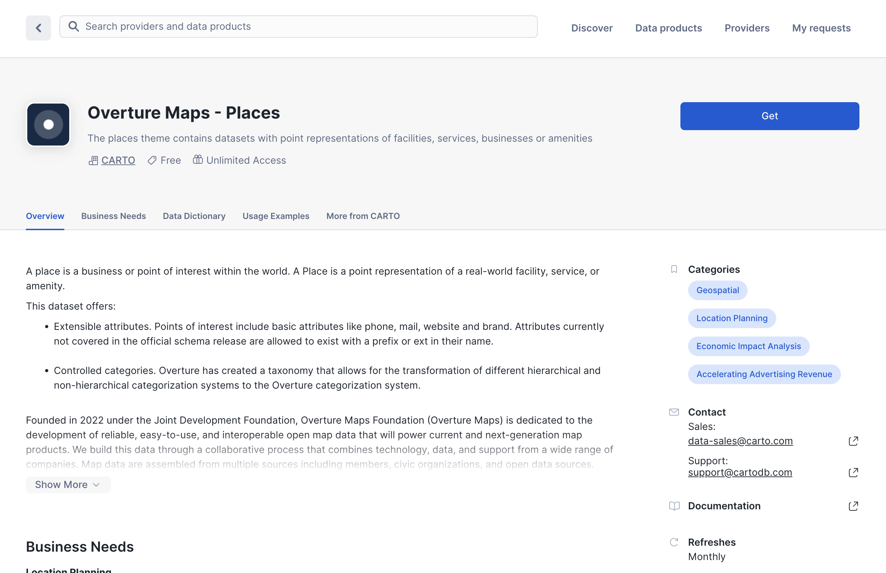
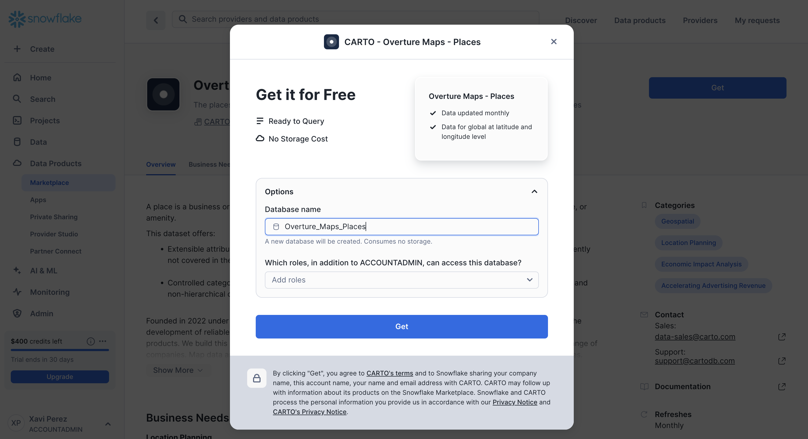
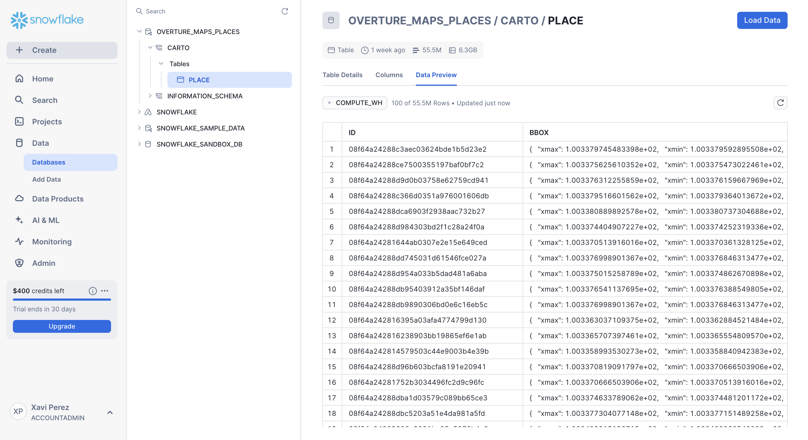
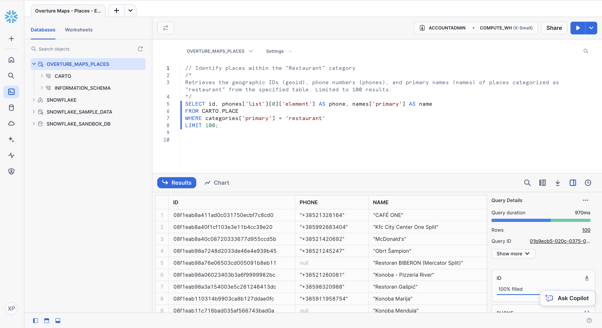

Overture data is accessible through the [Snowflake Data Marketplace](https://app.snowflake.com/marketplace/providers/GZT0ZKUCHE3/CARTO) via public listings published and maintained by [CARTO](https://www.carto.com). Below is a step-by-step guide on how to access and use the data:

## Getting Overture data from Snowflake Marketplace

1. Log in to your Snowflake account. Note that you must have an active Snowflake account with the necessary permissions to access the Data Marketplace.
2. In the Snowflake interface, navigate to the **Marketplace** tab in the sidebar menu within section **Data Products**.

    

3. Use the search bar at the top of the Data Marketplace and enter `CARTO`.
4. The listings have been organized by Overture theme; therefore, you will find the following listings available: Addresses, Base, Buildings, Divisions, Places and Transportation. Select one to access the listing details.

    

5. Review the data description, example queries, terms of use, etc.
6. Click on **Get**.

    

7. After clicking on **Get**, you are allowed to specify the name of the database in which to include the data and the user roles that will be able to work with it.

    

## Working with Overture data in Snowflake

1. After access is granted, navigate to the **Databases** section in Snowflake (under **Data**).
2. Locate the Overture dataset in the database that you have just created.

    

3. Once the database is created, you can then navigate to your worksheet in Snowflake and start working with the data.
4. Use SQL to query the Overture data. Below is an example query to retrieve some attributes from the Places data in Overture.

    ```sql
    -- Identify places within the "Restaurant" category
    SELECT id, phones['list'][0]['element'] AS phone, names['primary'] AS name
    FROM CARTO.PLACE
    WHERE categories['primary'] = 'restaurant'
    LIMIT 100;
    ```

    

## Additional notes

- **Updates**: CARTO regularly updates the Overture datasets in Snowflake and keeps the listings synced with the last release. You can check the release version of the data from the share description in each listing.
- **Support**: If you encounter issues accessing the data, contact CARTO support via [support@carto.com](mailto:support@carto.com).
- **Snowflake**: For more information on Snowflake Data Marketplace, refer to the official [Snowflake documentation](https://docs.snowflake.com/en/user-guide/data-marketplace.html).
