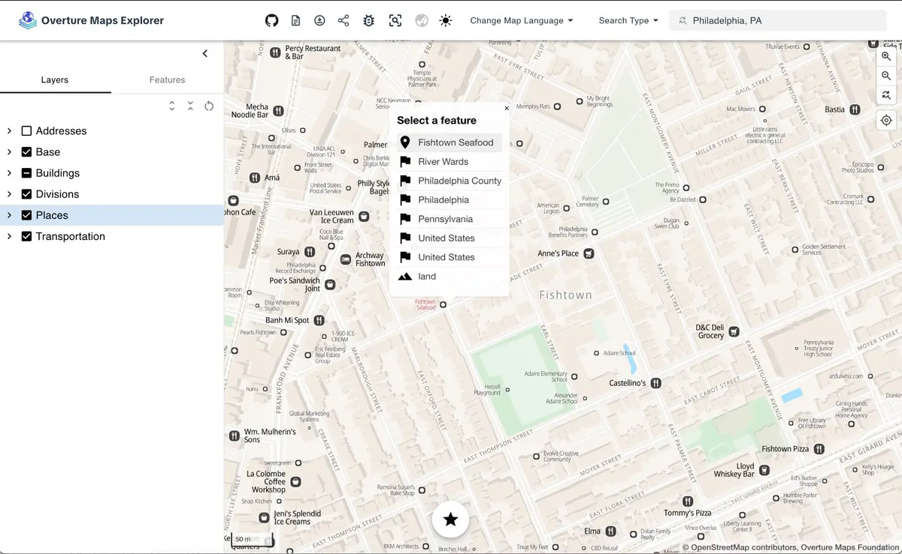
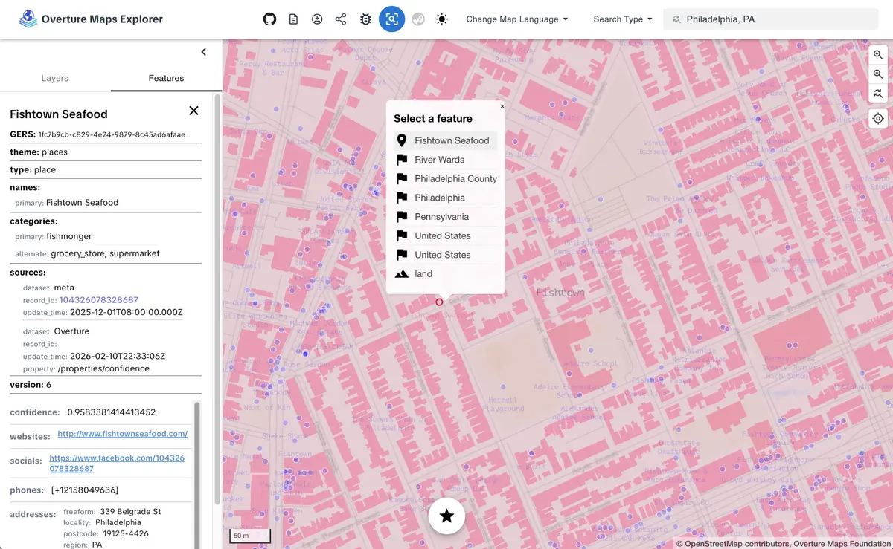
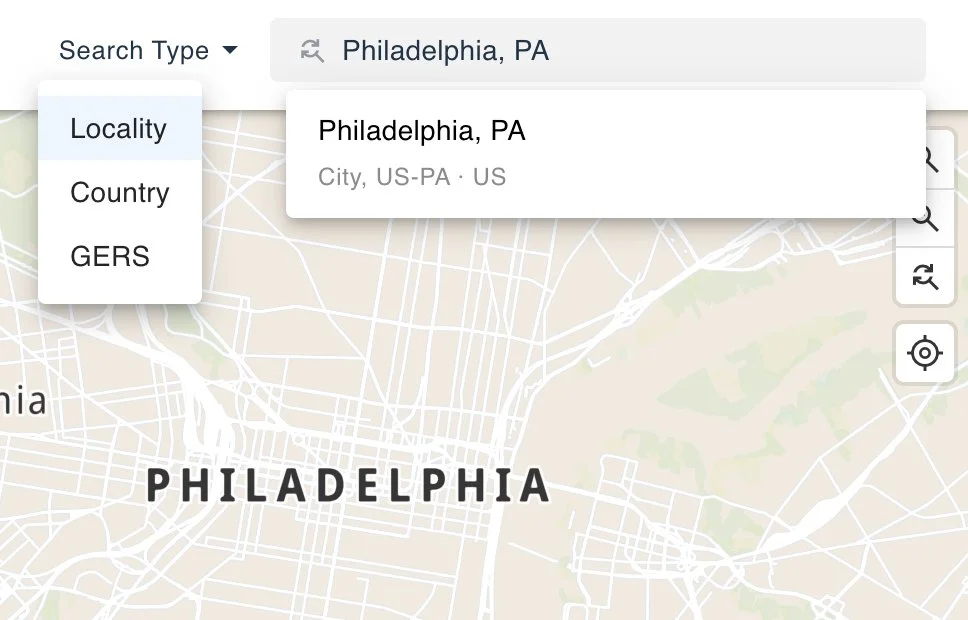

---

[Overture Maps Explorer](https://explore.overturemaps.org) is a no-code, browser-based tool for browsing, searching, and inspecting the data and schema. Explorer is the fastest way to answer these questions:

- What does Overture data look like in a specific area?
- What properties are on a building or a road segment?
- How does Overture represent a particular place or address?
- What's the GERS ID for a specific feature?

You can download data directly from Explorer or you can use it for visual inspection of the data before writing queries with the [Python Client](/getting-data/overturemaps-py/) or [DuckDB](/getting-data/duckdb/).

## Explore and Inspect modes

**Explore mode** presents the data as a styled, readable map. Browse places, roads, buildings, land use, and water features with cartographic styling. Toggle feature types on and off in the layers panel and click features to see their properties.

<figure className="screenshot-frame">

<figcaption>Explore mode showing places in the Fishtown neighborhood of Philadelphia. The layers panel on the left toggles Overture's six themes on and off.</figcaption>
</figure>

**Inspect mode** exposes the raw data. The layers panel mirrors the Overture schema: base breaks down into land, water, bathymetry, land cover, and land use; transportation shows segments and connectors; divisions shows areas, boundaries, and labels. Features are symbolized as simple points, lines, and polygons.

<figure className="screenshot-frame">

<figcaption>Inspect mode showing the properties panel for a place feature in Philadelphia. The panel displays the feature's GERS ID, category, source attribution, confidence score, and address.</figcaption>
</figure>

## Search

The Explorer includes a search bar for navigating directly to a location or feature. Use the **Search Type** dropdown to switch between search modes.

<figure className="screenshot-frame screenshot-frame--narrow">

<figcaption>Searching for "Philadelphia, PA" by locality. The Search Type dropdown also supports Country and GERS ID lookups.</figcaption>
</figure>

**Locality** and **Country** searches use a [geocoding service](https://github.com/brad-richardson/overture-geocoder) built entirely from Overture's divisions data. It covers 450K+ cities, neighborhoods, and administrative areas worldwide, with full-text search and autocomplete.

**GERS** search lets you jump directly to a specific feature by its [GERS ID](/gers/). This lookup is powered by the GERS manifest published in the [Overture STAC catalog](/getting-data/cloud-sources/), which maps every GERS ID to a bounding box. Paste a GERS ID into the search bar to fly to that feature on the map.

## Multilingual names

Toggle between languages to see place names rendered in dozens of scripts. This comes from the `names` field in Overture data, which carries common names, alternate names, and translations.

## How it works

Explorer is built with [MapLibre GL JS](https://maplibre.org/) and powered by [PMTiles](https://docs.protomaps.com/pmtiles/) vector tile archives generated from each Overture release. Tiles are hosted on S3 and loaded directly in the browser.

The site uses a token-based design system: primitives (color palette, fonts), semantics (feature-level color assignments), and components (stylesheet properties referencing the semantic values). A new style requires changing one file.

Explorer is pinned to a specific Overture release. Updates go through a validation process that audits stylesheets against the current schema and tile metadata before reaching the live site.

Source code: [explore-site](https://github.com/OvertureMaps/explore-site) repository.

## Next steps

- Use the [Python Client](/getting-data/overturemaps-py/) to download features by bounding box or the [DuckDB guide](/getting-data/duckdb/) to query the full dataset with SQL. 
- Explorer surfaces properties like GERS IDs, categories, and source attribution. To learn what those fields mean and how the data is structured, explore the [schema reference](/schema/).
- Found a bug in the Explorer? Want to request a new feature? Open an issue in the [explore-site](https://github.com/OvertureMaps/explore-site) repository.
- Found an issue in the underlying data? Open an issue in the [data](https://github.com/OvertureMaps/data) respository.